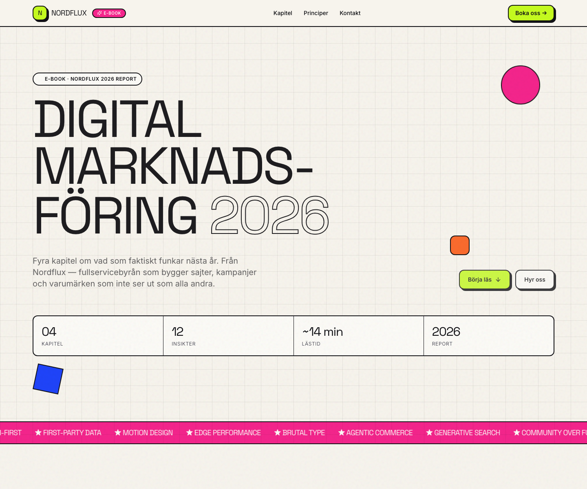

# Nordflux E-Book

An interactive editorial microsite for **Nordflux**, designed as a digital 2026 marketing report with horizontal chapters, bold typography, and motion-led reading flow.



## Live Site

- Netlify: [nordflux-ebook-2026.netlify.app](https://nordflux-ebook-2026.netlify.app)

## Topics

`react` · `typescript` · `vite` · `tailwindcss` · `framer-motion` · `netlify` · `static-site` · `digital-marketing` · `editorial-design` · `microsite`

## Project Overview

This project presents four themed chapters about digital marketing in 2026:

- AI and search behavior
- content systems
- first-party data
- bolder web design and brand presence

Instead of behaving like a traditional PDF-style report, the site is built as a reading experience on the web. It combines large-format editorial layout, animated transitions, and horizontally framed chapter sections to make the content feel more like a designed digital product than a static document.

## What The Project Shows

- editorial-style frontend design
- scroll-based motion and section transitions
- strong visual hierarchy with brutalist-inspired direction
- structured long-form content in a modern React/Vite stack
- continuous deployment to Netlify from `main`

## Tech Stack

- React 18
- TypeScript
- Vite 5
- Tailwind CSS
- Framer Motion
- shadcn/ui primitives

## Version History

`nordflux-ebook` is the canonical home for this project.

It now also preserves the earlier predecessor repo `digital-text-canvas` as version branches:

- `main`
  - current standalone `nordflux-ebook`
- `version/2026-05-01-digital-text-canvas-before-template-cleanup`
  - earlier predecessor state before the final cleanup pass
- `version/2026-05-05-digital-text-canvas-final`
  - later predecessor state just before the project became its own standalone repo

This keeps the development story visible without leaving duplicate repositories behind.

## Local Development

```bash
npm install
npm run dev
```

Default local development URL:

```text
http://localhost:8080
```

## Production Build

```bash
npm run build
```

## Netlify Deployment

The site is hosted on Netlify as **nordflux-ebook-2026** and deploys automatically when changes land on `main`.

Deployment details:

- platform: [Netlify](https://www.netlify.com/)
- site name: `nordflux-ebook-2026`
- build command: `npm run build`
- publish directory: `dist/`
- config: [netlify.toml](./netlify.toml)
- SPA routing: handled via Netlify redirects

`netlify.toml` also sets security headers and long-lived caching for hashed assets under `/assets/`.

## Project Structure

```text
src/
├── components/ebook/    # Hero, navbar, chapters, principles, CTA, footer
├── lib/ebook-data.ts    # Structured report content
├── pages/Index.tsx      # Main reading experience
└── index.css            # Design tokens and global styling
```

## Content Editing

Most of the editorial content is managed in:

- [src/lib/ebook-data.ts](./src/lib/ebook-data.ts)

That makes it easy to update chapter copy, insight blocks, and report details without touching the whole component tree.

## Why This Repo Matters

This repo is not only a design piece. It also reflects a cleanup decision:

- the duplicate predecessor repos were consolidated
- the best current version was kept as the public main repo
- earlier stages were preserved through branches instead of cluttering GitHub with copies

So it works both as a frontend showcase and as an example of better repository hygiene.
